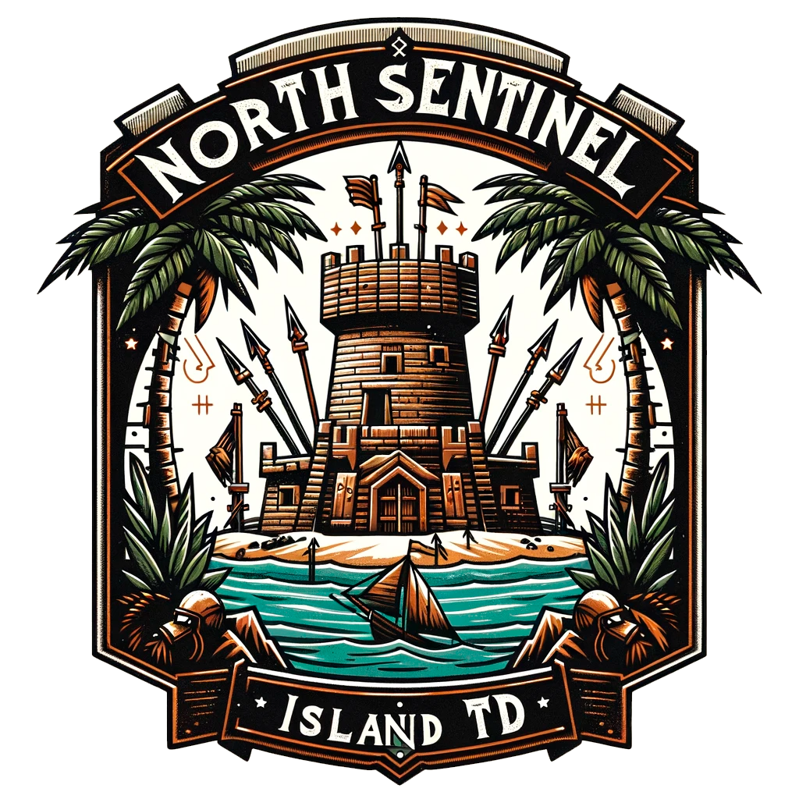
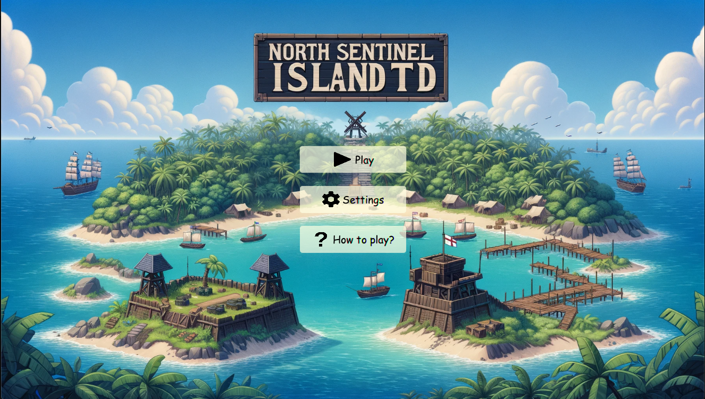
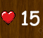
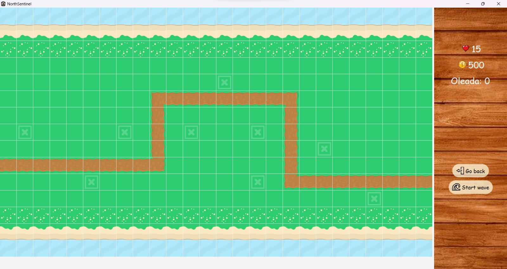

# North Sentinel
## ¿Qué es North Sentinel?
North Sentinel es un videojuego al más puro estilo Tower Defense desarrollado usando Java y JavaFX.

Tu objetivo como jugador se basa en defender la isla de North Sentinel frente al ataque sin descanso de las tropas inglesas. Los soldados recorrerán el camino desde la playa hasta el pueblo con la intención de llegar hasta allí y masacrar a los indígenas que habitan esta isla. Mediante la colocación de torretas (defensas) debes matar a estos sanguinarios soldados para evitar perder tu partida. 

Comenzarás tu aventura con 15 vidas y 500 monedas que te permitirán colocar tu primera torreta. Cada vez que un soldado logré traspasar todo el camino y llegar al pueblo perderás una vida.

## Pantalla inicial del juego
Al iniciar el juego podrás observar un pequeño menú con tres opciones diferentes, podrás irte directamente a la aventura mediante la opción "Play", podrás ajustar el volumen de juego en "Settings" o puedes conocer un poco más sobre los enemigos y las torretas si te diriges a la opción de "How to play?".

## Elementos del juego
El juego consta de varios elementos como los soldados ingleses (enemigos), las torretas (defensas) que podremos ir colocando, las monedas que nos permitirán comprar nuevas torretas y la vida que nos mantendrá en pie para seguir defendiendo nuestra isla.

**Posisición torreta:** En estos puntos exactos podemos proceder a colocar nuestras torretas para defendernos.

**Vida:**  Comenzarás la partida con un total de 15 vidas que podrás ir perdiendo, recuerda que cada enemigo te resta 1 si consigue llegar al pueblo.

**Monedas:**   Al iniciar la partida se te otorgan 500 monedas para colocar la primera torreta, pero ten cuidado.... cada torreta cuesta 500 monedas y esto es un pueblo humilde.

**Enemigos:**  Los soldados ingleses están furiosos y tratarán de llegar a toda costa hasta el pueblo para pagar su frustación con sangre fresca. Cada soldado que llegue hasta el pueblo nos quitará una vida y cada soldado que matemos nos otorgará 20 monedas a nuestro saldo. Sin embargo tras cada oleada estos se hacen mas duros de roer.

**Balas:**  Cada bala disparada por nuestras torretas será capaz de quitar 25 unidades de vida a los soldados ingleses, pero ten cuidado que estos tras cada oleada se hacen más fuertes. 

## Salva al pueblo de la masacre
Tras darle al "Play" nos sumergimos directamente en el mundo del Tower Defense. Observamos el mapa de la isla por dónde los soldados ingleses recorrerán el camino desde la playa hasta el pueblo intentando invadir la isla. Tenemos también conocimiento en todo momento de la salud y dinero que nos queda, número de oleada y la posibilidad de volver al menú y lanzar la siguiente oleada.

### Autores:
1. Iván Garrido Durbán
2. Feliciano Morales Pérez
3. Samuel Padrón Padrón

